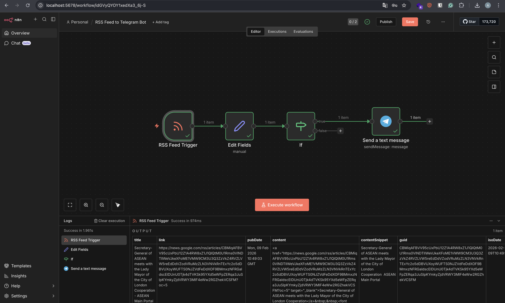

# 📡 RSS Feed to Telegram Bot

> Automate monitoring RSS feeds and send updates directly to your Telegram channel using n8n.


## 📌 Overview

This project automates monitoring an RSS feed and sends updates directly to a Telegram channel using **n8n**. It is useful for tracking blog posts, tech news, or content updates without manual checking.



### Tech Stack

| Technology | Purpose |
|------------|---------|
| n8n | Workflow automation platform |
| Telegram Bot API | Message delivery |
| RSS Feed | Content source |
| JSON | Workflow configuration |

## 🎯 Features

- ✅ Automatically checks RSS feeds every hour
- ✅ Sends formatted updates to a Telegram channel
- ✅ Filters posts using keyword conditions
- ✅ Error handling when no new content is found
- ✅ Exportable workflow JSON for reuse

## 🛠️ Workflow Architecture

```
RSS Feed Trigger → Set Node → IF Node (optional filter) → Telegram Node
```

### Node Functions

| Node | Function |
|------|----------|
| RSS Feed Trigger | Fetches latest RSS entries |
| Set Node | Formats message (title + link) |
| IF Node | Sends only if keyword matches |
| Telegram Node | Sends message to Telegram channel |

## 🚀 Setup Guide

### 1️⃣ Create Telegram Bot

1. Open Telegram
2. Message `@BotFather`
3. Run command: `/newbot`
4. Save the **Bot Token**
5. Create a Telegram channel
6. Add the bot as **Admin**

### 2️⃣ Configure RSS Feed in n8n

1. Add **RSS Feed Trigger** Node
2. Set polling interval to `1 hour`
3. Add RSS feed URL (example: tech blog, news feed)
4. Test node execution

### 3️⃣ Build the Automation Workflow

**RSS Feed Trigger Node** → **Set Node** (format message):

```text
📰 New Article Published  
Title: {{$json["title"]}}  
Link: {{$json["link"]}}
```

**Telegram Node:**
- Use Bot Token
- Target Telegram Channel ID
- Send formatted message

### 4️⃣ Add Keyword Filtering (Optional)

Add an **IF Node** to send only specific content:

```javascript
{{$json["title"].includes("AI")}}
```

> This ensures only AI-related posts are sent.

## 🧪 Testing

1. Post a new article to the RSS feed
2. Wait for scheduled trigger or run manually
3. Confirm message appears in Telegram channel

## � Project Structure

```
rss-telegram-bot/
├── workflow/
│   └── rss-telegram-bot.json
├── README.md
└── assets/
    └── demo.png
```

## 📦 Installation

1. Clone this repository
2. Import the workflow JSON into n8n
3. Configure your Telegram Bot credentials
4. Update RSS feed URL
5. Activate the workflow

```bash
# Import workflow in n8n
# Go to: Workflows → Import from File → Select rss-telegram-bot.json
```

## 💡 Use Cases

- 📰 Tech news alerts
- 📝 Blog update notifications
- 🔬 Research monitoring
- 📚 Personal learning dashboards
- 💰 Crypto or finance news tracking

## 📌 Future Improvements

- [ ] Store sent articles in database to avoid duplicates
- [ ] Add sentiment analysis on news titles
- [ ] Send daily summary instead of per-post messages
- [ ] Deploy workflow on cloud n8n server

## 🎥 Demo

> 📹 [Watch Demo Video](#) *(Add Loom link here)*

## 👨‍💻 Author

**Andri Puji Prasetiyo**  
Automation & AI Engineering Learner  
*Target: Build Production-Ready AI Portfolio*

---

## 📄 License

This project is open source and available under the [MIT License](LICENSE).